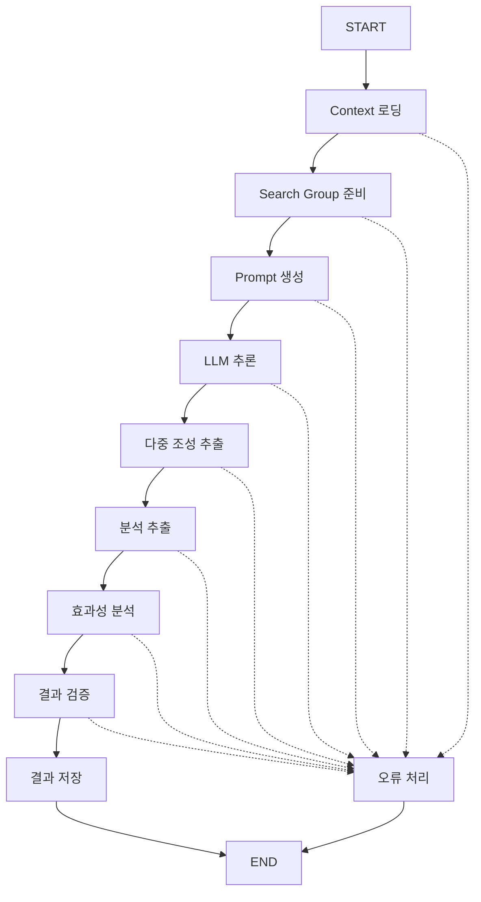

# Langgraph 기반 LLM Catalyst Agent

이 프로젝트에 **Langgraph 프레임워크**를 도입하여 기존의 `main.py` 파이프라인을 그래프 기반 워크플로우로 재구성했습니다.

## 🚀 주요 변경사항

### 1. 새로운 파일 구조
- `agent/langgraph_nodes.py`: 각 기능을 Langgraph 노드로 정의
- `agent/output_parsers.py`: **OutputParser 시스템** 🆕
- `langgraph_main.py`: Langgraph 기반 메인 실행 파일
- `README_LANGGRAPH.md`: 이 문서

### 2. 그래프 기반 워크플로우
기존의 순차적 실행을 그래프 노드로 변환:



### 3. 🧩 OutputParser 시스템
LLM 출력을 구조화된 데이터로 변환하는 전용 파서 시스템:

#### 파서 종류
- **`CompositionOutputParser`**: 촉매 조성 추출 전용 (단일)
- **`MultipleCompositionOutputParser`**: 다중 조성 추출 전용 🆕
- **`EnhancedAnalysisOutputParser`**: 전체 분석 결과 파싱 (다중 조성 지원)
- **`FlexibleOutputParser`**: 복합 파싱 시스템

#### 주요 기능
- ✅ **다중 전략 파싱**: 7가지 파싱 전략으로 높은 성공률
- ✅ **유효성 검증**: 조성 비율 합계, 범위 검증
- ✅ **구조화된 출력**: Analysis, Recommendations, Compositions 별도 추출
- ✅ **다중 조성 지원**: 3-5개 조성을 동시에 추천 🆕
- ✅ **확장 가능**: 새로운 파서 타입 쉽게 추가

## 📦 설치 및 설정

### 1. 필수 패키지 설치
```bash
pip install -r requirements.txt
```

새로 추가된 패키지:
- `langgraph>=0.0.40`: 그래프 기반 워크플로우 프레임워크
- `langchain>=0.1.0`: LangChain 코어 라이브러리
- `langchain-core>=0.1.0`: LangChain 핵심 컴포넌트

### 2. 환경 설정
기존과 동일한 환경 설정이 필요합니다:
- OpenAI API 키
- MCP 서버 설정
- 데이터 파일들

## 🔧 사용법

### 기본 실행
```bash
python langgraph_main.py
```

### 그래프 구조 시각화
```python
from langgraph_main import visualize_graph
visualize_graph()
```

### OutputParser 단독 사용
```python
# 단일 조성 파싱
from agent.output_parsers import create_composition_parser
parser = create_composition_parser(validation=True)
composition = parser.parse(llm_output)

# 다중 조성 파싱 🆕
from agent.output_parsers import create_multiple_composition_parser
multi_parser = create_multiple_composition_parser(validation=True)
compositions = multi_parser.parse(llm_output)  # 리스트 반환
```

## 🎯 노드 정의

### 1. `load_context_node`
- **기능**: Context 파일 로딩
- **입력**: 없음
- **출력**: `state["context"]`

### 2. `prepare_search_group_node`
- **기능**: Search group 데이터 준비
- **입력**: 없음
- **출력**: `state["search_group"]`

### 3. `generate_prompt_node`
- **기능**: System + User prompt 결합 생성
- **입력**: `context`, `search_group`
- **출력**: `state["prompt"]`

### 4. `llm_inference_node`
- **기능**: LLM 추론 (MCP tools 사용)
- **입력**: `prompt`
- **출력**: `state["llm_output"]`, `state["tool_summary"]`

### 5. `extract_compositions_node` 🆕
- **기능**: MultipleOutputParser로 다중 조성 추출
- **입력**: `llm_output`
- **출력**: `state["extracted_compositions"]` (리스트)
- **파서**: `MultipleCompositionOutputParser`

### 6. `extract_analysis_node` 🆕
- **기능**: 구조화된 분석 결과 추출 (다중 조성 지원)
- **입력**: `llm_output`
- **출력**: `state["extracted_analysis"]`
- **파서**: `EnhancedAnalysisOutputParser`

### 7. `analyze_effectiveness_node`
- **기능**: MCP Tools 효과성 분석
- **입력**: `tool_summary`
- **출력**: 분석 결과 출력

### 8. `validate_results_node` 🆕
- **기능**: 추출 결과 검증 및 요약
- **입력**: 모든 추출 결과
- **출력**: 검증 요약

### 9. `save_results_node`
- **기능**: 결과 저장
- **입력**: 모든 상태 데이터
- **출력**: `results/latest_result.json`

### 10. `error_handler_node`
- **기능**: 오류 처리 및 로깅
- **입력**: 오류 상태
- **출력**: `results/error_log.json`

## 🔄 상태 관리

### AgentState 구조
```python
class AgentState(TypedDict):
    context: Dict[str, Any]
    search_group: Dict[str, Any]
    prompt: str
    llm_output: str
    extracted_compositions: List[Dict[str, Any]]  # 🆕 복수형 리스트
    extracted_analysis: Dict[str, Any]
    tool_summary: Dict[str, Any]
    result: Dict[str, Any]
    timestamp: str
    error: str
```

## 🚨 오류 처리

각 노드에서 오류가 발생하면:
1. `state["error"]`에 오류 메시지 저장
2. `error_handler_node`로 라우팅
3. `results/error_log.json`에 오류 로그 저장
4. 프로세스 종료

## 📈 OutputParser 장점

### 1. **높은 파싱 성공률**
```python
# 7가지 파싱 전략으로 다양한 출력 형식 지원
- 직접 dict 형태
- **COMPOSITION:** 섹션
- composition = {...} 라인
- 코드 블록
- 한국어 형식
- 일반 dict 패턴
```

### 2. **구조화된 데이터 추출**
```json
{
  "analysis": "Based on the Sabatier principle...",
  "recommendation": "The Ni₀.₆Cu₀.₄ composition...",
  "composition": {"Ni": 0.6, "Cu": 0.4}
}
```

### 3. **유효성 검증**
- 숫자 범위 확인 (0-1)
- 비율 합계 검증 (≈1.0)
- 타입 검증

### 4. **확장성**
```python
class CustomOutputParser(BaseOutputParser):
    def parse(self, text: str) -> Any:
        # 새로운 파싱 로직
        pass
```

### 5. **다중 조성 추천 시스템** 🆕
```python
# 예상 출력: 3-5개 조성 추천
[
    {"Ni": 0.6, "Cu": 0.4},    # 1순위: 최적 성능
    {"Ni": 0.7, "Cu": 0.3},    # 2순위: 높은 안정성
    {"Pd": 0.5, "Ag": 0.5},    # 3순위: 대안 시스템
    {"Pt": 0.8, "Ru": 0.2},    # 4순위: 고성능 후보
    {"Fe": 0.6, "Co": 0.4}     # 5순위: 경제적 옵션
]
```

## 🔍 기존 vs OutputParser 비교

| 구분 | 기존 parse_composition | OutputParser 시스템 |
|------|----------------------|-------------------|
| 구조 | 단일 메서드 | 클래스 기반 파서들 |
| 전략 | 하드코딩된 regex | 다중 전략 패턴 |
| 검증 | 없음 | 유효성 검증 포함 |
| 확장성 | 메서드 수정 필요 | 새 파서 클래스 추가 |
| 재사용성 | LLMAgent 내부만 | 독립적 사용 가능 |
| 테스트 | 통합 테스트만 | 단위 테스트 가능 |
| 로깅 | 기본 로깅 | 상세한 전략별 로깅 |

## 🧪 테스트

### 기능 테스트
```bash
# 기존 방식
python main.py

# Langgraph + OutputParser 방식
python langgraph_main.py
```

### OutputParser 단위 테스트
```python
from agent.output_parsers import create_composition_parser

# 테스트 예시
parser = create_composition_parser()
test_output = """
**COMPOSITION:**
composition = {"Ni": 0.6, "Cu": 0.4}
"""
result = parser.parse(test_output)
assert result == {"Ni": 0.6, "Cu": 0.4}
```

### 결과 비교
두 방식 모두 동일한 결과를 생성하지만 OutputParser 방식이 더 안정적:
- `results/latest_result.json`
- MCP tools 사용 통계
- 조성 추출 결과
- **분석 결과 구조화** 🆕

## 🚧 향후 개선 사항

1. **고급 파서**: JSON Schema 기반 파서
2. **실시간 검증**: 조성의 화학적 유효성 확인
3. **다국어 지원**: 영어/한국어 외 언어 지원
4. **커스텀 파서**: 도메인별 특화 파서
5. **파싱 통계**: 파싱 성공률 모니터링

## 📝 마이그레이션 가이드

### 기존 사용자
1. 새로운 패키지 설치: `pip install -r requirements.txt`
2. 기존 `main.py` 대신 `langgraph_main.py` 사용
3. **향상된 파싱 결과** 확인

### 개발자
1. **새로운 파서 구현**:
   ```python
   class MyCustomParser(BaseOutputParser):
       def parse(self, text: str) -> Any:
           # 커스텀 파싱 로직
           pass
   ```

2. **노드에서 파서 사용**:
   ```python
   from agent.output_parsers import create_composition_parser
   
   parser = create_composition_parser(validation=True)
   result = parser.parse(llm_output)
   ```

3. **그래프에 노드 연결**: `langgraph_main.py`에서 워크플로우 확장

---

**참고**: 
- 기존 `main.py`는 그대로 유지되므로 언제든 이전 방식으로 돌아갈 수 있습니다
- OutputParser는 독립적으로 사용 가능하여 다른 프로젝트에서도 재사용할 수 있습니다
- **다중 조성 추천 시스템**으로 더 폭넓은 후보 탐색과 비교 분석이 가능합니다 🆕 